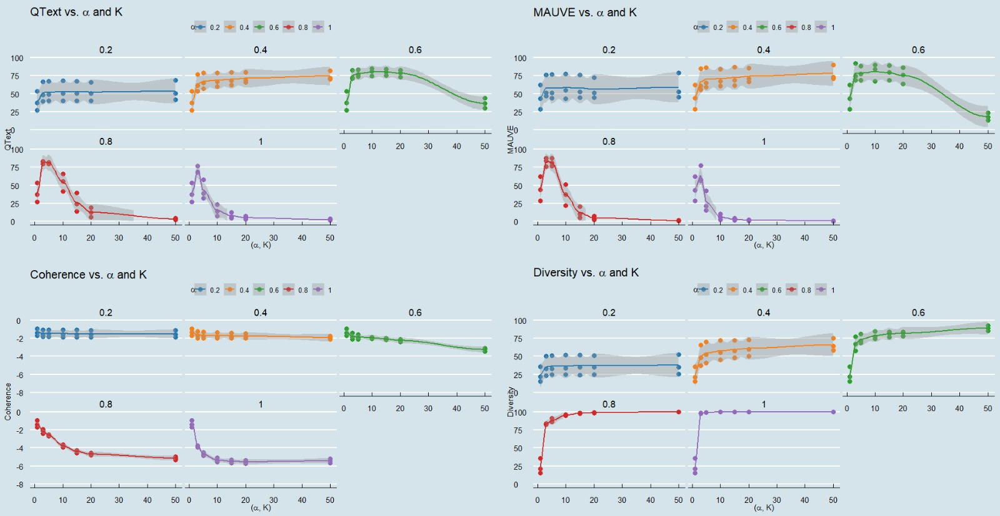

# Decoding-Decoded
Official PyTorch Implementation of "Decoding Decoded: Understanding Hyperparameter Effects in Open-Ended Text Generation"


<p align="center">
  
</p>


## Table of Contents 📖  <a href="#top">[Back to Top]</a>

- [Dependency Installation](#Dependency-installation-)
- [Run LLM Inference Experiments](#Run-LLM-Inference-Experiments-)
- [Benchmark Decoding Methods](#Benchmark-Decoding-Methods-)
  - [Measure Diversity, Generation Length and MAUVE Score](#Measure-Diversity,-Generation-Length-and-MAUVE-Score-)
- [Log Benchmark Results](#Log-Benchmark-Results-)
- [Contributions](#Contributions-)

## Dependency Installation 🌋 <a href="#top">[Back to Top]</a> <a name="dependency-installation-"></a>

To install all the dependencies for our paper, run the following command:
```bash
pip install -r requirements.txt
SKLEARN_ALLOW_DEPRECATED_SKLEARN_PACKAGE_INSTALL=True pip install simctg
```

We recommend you to build a new conda environment to use the repository.

```bash
conda create -n decoding-decoded python=3.11
conda activate decoding-decoded
pip install -r requirements.txt
SKLEARN_ALLOW_DEPRECATED_SKLEARN_PACKAGE_INSTALL=True pip install simctg
```

## Run LLM Inference Experiments 🚀 <a href="#top">[Back to Top]</a> <a name="run-llm-inference-experiments-"></a>

We compared 5 different decoding methods in our paper, those are: **Contrastive Search, Top-k Sampling, Top-p Sampling, Beam Search and Temperature Scaling**. We compare those methods with the following hyperparameter combinations:

- **Contrastive Search**: alpha=0.2, 0.4, 0.6, 0.8, 1.0, k=1, 3, 5, 10, 15, 20, 50
- **Top-k Sampling**: k=1, 3, 5, 10, 15, 20, 50
- **Top-p Sampling**: p=0.6, 0.7, 0.8, 0.9, 0.95
- **Beam Search**: beam_size=3, 5, 10, 15, 20, 50
- **Temperature Scaling**: temperature=0.1, 0.3, 0.5, 0.7, 0.9, 1.0
We run the decoding methods on the following 6 models:
- **Llama-3.1-8B** [Llama-3.1 link](https://www.llama.com/)
- **gpt2-xl** [GPT-2 link](https://openai.com/index/better-language-models/)
- **Mistral-7B-v0.3** [Mistral link](https://mistral.ai/)
- **Mistral-7B-v0.1** [Mistral link](https://arxiv.org/abs/2310.06825)
- **Qwen/Qwen2-7B** [Qwen link](https://arxiv.org/abs/2407.10671)
- **falcon-11B** [Falcon link](https://arxiv.org/abs/2407.14885)


We then benchmark the decoding quality and perplexity of those decoding methods. Please check the **Benchmark Decoding Methods** section for more details.

You may need to authorize by logging in to the Hugging Face to run the experiments for Llama-3.1 and Mistral-7B-v0.3.

```bash
huggingface-cli login
```

To run the LLM inference experiments for contrastive search decoding method, run the following command:
```bash
python llm_exp/llm_contrastive_search.py \
--dataset wikitext \
--k 20 \
--alpha 0.8 \
--save_file misrtalv03 \
--save_path_prefix Mistralv03-alpha08 \
--model_name mistralai/Mistral-7B-v0.3 \
--cuda 0 \
--dataset_prefix ./data
```

To run the LLM inference experiments for top-k sampling decoding method, run the following command:
```bash
python llm_exp/llm_top-k.py \
--k 20 \
--save_file gpt2-xl \
--save_path_prefix GPT2-XL-topk \
--dataset wikitext \
--model_name openai-community/gpt2-xl \
--cuda 0 \
```

To run the LLM inference experiments for top-p sampling decoding method, run the following command:
```bash
python llm_exp/llm_top-p.py \
--p 0.95 \
--save_file qwen2 \
--save_path_prefix Qwen2-topp \
--dataset wikitext \
--model_name Qwen/Qwen2-7B \
--cuda 0 \
```

To run the LLM inference experiments for beam search decoding method, run the following command:

```bash
python llm_exp/llm_beam-search.py \
--num_beams 5 \
--save_file llama-3_1 \
--dataset wikinews \
--model_name meta-llama/Meta-Llama-3.1-8B \
--save_path_prefix Llama-3_1-beam \
--cuda 0 \
```

To run the LLM inference experiments for temperature scaling decoding method, run the following command:

```bash
python llm_exp/llm_temp.py \
--temp 0.1 \
--save_file mistralv03 \
--dataset wikitext \
--model_name mistralai/Mistral-7B-v0.1 \
--save_path_prefix mistralv01-temp \
--cuda 0 \
```

## Benchmark Decoding Methods 🧪 <a href="#top">[Back to Top]</a> <a name="benchmark-decoding-methods-"></a>

To benchmark the decoding methods, please make sure you have all the dependencies installed.

We provide several ways of measuring the diversity, generation length and MAUVE score of the generated texts. Please choose one of them to measure the quality of the generated texts based on your needs.

### Measure Diversity, Generation Length and MAUVE Score 🧪 <a href="#top">[Back to Top]</a> <a name="measure-diversity,-generation-length-and-mauve-score-"></a>

#### Measure Diversity, Generation Length and MAUVE Score for a single generated text file
To measure the diversity, generation length and MAUVE score of the generated texts for a single generated text file, please run the following command:

```bash
# change the test path to the file path you want to evaluate
bash scripts/measure_single_mauve.sh YOUR_TEST_PATH
bash scripts/measure_single_coherence.sh YOUR_TEST_PATH
```

#### Measure Diversity, Generation Length and MAUVE Score for a folder of generated text files
To measure the diversity, generation length and MAUVE score of the generated texts for a folder of generated text files, for example ".../Qwen-beam/Qwen2-beam/" which contains three subfolders of generated text files, please run the following command:

```bash
bash scripts/measure_mauve.sh YOUR_FOLDER_PATH
bash scripts/measure_coherence.sh YOUR_FOLDER_PATH
```

#### Measure Diversity, Generation Length and MAUVE Score with one command pipeline
for all the generated text files under the root directory, please run the following command:
```bash
bash scripts/mauve_pipe.sh
bash scripts/coherence_pipe.sh
```
You may need to change the `COLING_DATA_DIR` in the script to the root directory of your generated text files. You may also need to change the `BASE_DIR` in the script based on your used models' names.

## Log Benchmark Results 📝 <a href="#top">[Back to Top]</a> <a name="log-benchmark-results-"></a>

To log the benchmark results based on different decoding methods, please run the following command:

To log the result folder generated by using the "contrastive search" decoding method, please run the following command:
```bash
python scripts/log_cs.py --folder_path YOUR_RESULT_PATH --save_path YOUR_SAVE_PATH
```

To log the result folder generated by using the "top-k sampling" decoding method, please run the following command:

```bash
python scripts/log_topk.py --folder_path YOUR_RESULT_PATH --save_path YOUR_SAVE_PATH
```

To log the result folder generated by using the "top-p sampling" decoding method, please run the following command:

```bash
python scripts/log_topp.py --folder_path YOUR_RESULT_PATH --save_path YOUR_SAVE_PATH
```

To log the result folder generated by using the "beam search" decoding method, please run the following command:

```bash
python scripts/log_beam.py --folder_path YOUR_RESULT_PATH --save_path YOUR_SAVE_PATH
```

To log the result folder generated by using the "temperature scaling" decoding method, please run the following command:

```bash
python scripts/log_temp.py --folder_path YOUR_RESULT_PATH --save_path YOUR_SAVE_PATH
```
python scripts/log_beam.py --folder_path YOUR_RESULT_PATH --save_path YOUR_SAVE_PATH

## Contributions 🤝 <a href="#top">[Back to Top]</a> <a name="contributions-"></a>

This repository is based on the following repositories:
- [Contrastive Search versus Contrastive Decoding](https://github.com/yxuansu/Contrastive_Search_versus_Contrastive_Decoding)

We thank the authors for their open-sourced code.
